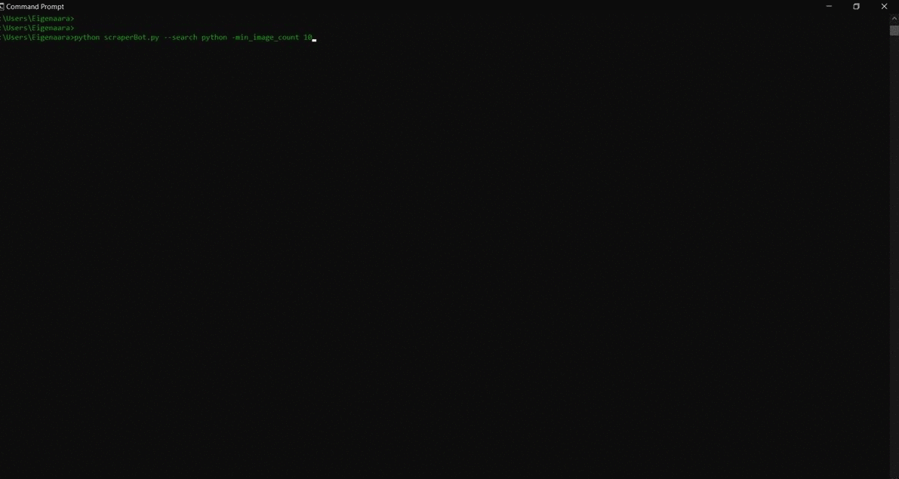

# ScraperBot
Example of the bot finding and downloading images of a python
<br>
<br>

<br>
This is a image scraper powered by selenium and written to function with google chrome and google images. It will download however many images you want from a specific search term if there are enough images to and websites that allow bots to download from them. The idea behind this scraper is to get sufficient images for deep learning and is a building block for other projects I have in mind. Some annoyances that this script may have, it uses command line arguments and searches one keyword at a time. It will download images if the site allowes it so not all images from the google images view will be gathered. Especially important for deep learning purposes is that the bot will download whatever it sees, so please curate the images. Your AI might learn some random things! This is not the fastest scraper out there, I wrote it to gather URLs from images first and then download the files if possible. This is to not over burden any websites with scraper traffic. Anyways follow the insturctions below to get scraping.
<br>
# Requirements
- [Google chrome](https://www.google.com/intl/en/chrome/)
- [chrome web driver](https://chromedriver.chromium.org/downloads)
- [Python 3](https://www.python.org/downloads/)

<br>
This bot only funcitons with chrome at the moment and thus you will need the google chrome browser. The next thing you need to know is your chrome version, this can be found by accessing the settings menu and navigating to the help menu then the about chrome menu. This will tell you which major version (the number before the first full stop) of chrome you have. Navigate to the chrome web driver downloads page and download the correct version. Finally download python 3 if you dont have it. 

# Installation
Download the repositiory from github or git clone it
```
git clone --recursive https://github.com/JamesGallant/ScraperBot.git
```
Now unzip the webdriver you have downloaded and move it into the ScraperBot folder. The program will not function without this step.

First make sure python is installed correctly and callable from the command line or terminal. There may be multiple versions of python installed on your system so make sure to use python 3. You can check this in the following way:
```
python --version
```
Your output should be **python** followed by the version number. If this is correct navigate to the directory within the command prompt and install the dependendancies. 
```
cd Path\to\script\directory

pip install -r requirements.txt
```
This should be enough to create a working environment.

# Usage
|Commands             |Method                                                 |Requirement |
|---------------------|-------------------------------------------------------|------------|
|`-h`                 |Display the help message                               |Optional    |
|`--search`           |Keyword for the google search                          |**Required**|
|`--min_image_count`  |Minimum number of images                               |**Required**|
|`--out_directory`    |The output directory, default is the script directory  |Optional    |

To call the help menu and display the table above use the help command:
```
python scraperBot.py -h
```
Example of running the bot with the required arguments
```
python scraperBot.py --search Python --min_image_count 10
```
# Note
This script will take control of your computer and open your browser until it is done. Also many websites disallow scraping so not all scanned images will be downloaded. 
